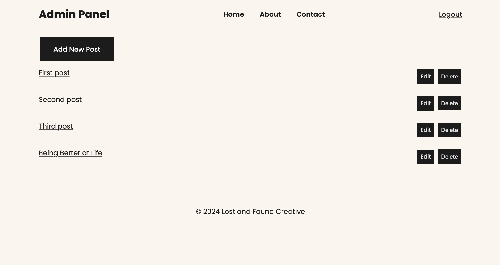
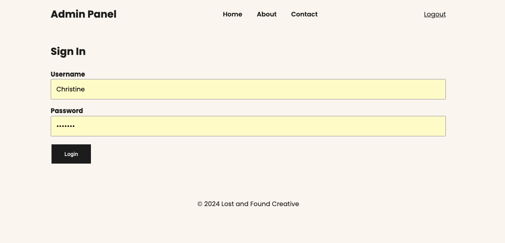
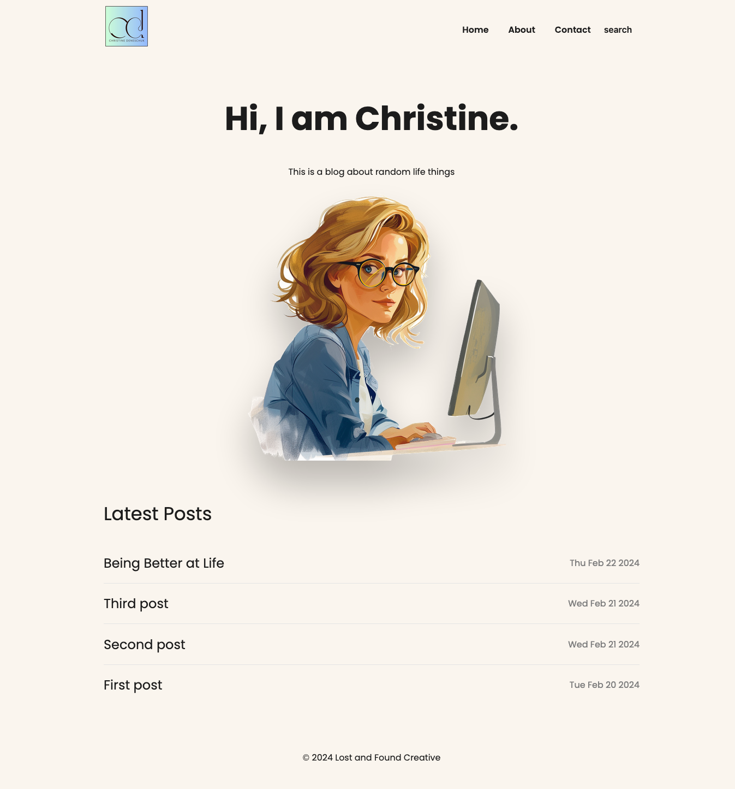

# Introduction

A Blog App followed from Net Ninja project. It is built using the MVC Architecture, implemented authorization so people can sign up, 
customize & personalize the app 

---

# Objectives

- It's an intermediate level app created to understand and solidify how MVC concepts and use data storage with Mongo.

---

# Packages/Dependencies used 

bcrypt, connect-mongo, dotenv, ejs, express, express-flash, express-session, mongodb, mongoose, morgan, nodemon, cookieparser.

---

# Install all the dependencies or node packages used for development via Terminal

`npm install` 

---

# Things to add

- Create a `.env` file and add the following as `key: value` 
  - PORT: 2121 (can be any port example: 3000) 
  - DB_STRING: `your database URI` 
 ---
 

